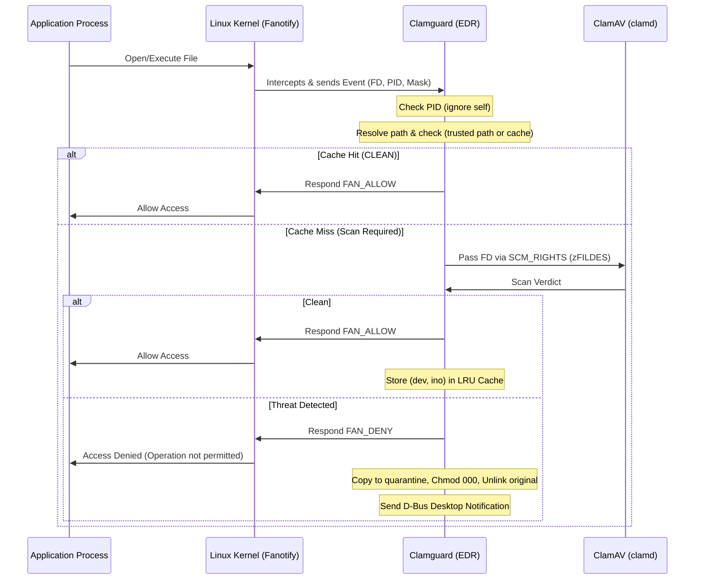

# Clamguard - ClamAV EDR

A lightweight, high-performance Endpoint Detection and Response (EDR) daemon for Linux systems. It utilizes the Linux **Fanotify API** to synchronously intercept file operations, filter noise, remember successful scans for unmodified files, and stream scanning to a local ClamAV daemon (`clamd`).

The key difference between this agent and `clamonacc` is being able to follow and traverse mount points under the watched path. For example, if watching `/` and using docker containers, those containers are also properly scanned. This is not the case with `clamonacc`.

## Features & Architecture

* **Two-FD Fanotify Architecture**:
  * **Blocker (Primary)**: Synchronously track file open and file close-after-writing on the specified watch path.
  * **Watchdog (Secondary Mount Tracker)**: Tracks mounts being added/removed under the watch path. This is the key difference compared to `clamonacc` which does not follow new mount points.
* **Zero-Copy Scanning**: Hands a file descriptor to `clamd` rather than copying the file contents.
* **Fail-Closed Architecture**: 2-second Go context timeout for scans, failing closed (`FAN_DENY`) on timeout.
* **Incident Mitigation**:
  * Denies kernel access requests for infected files.
  * Copies the infected file to `/var/spool/clamav-quarantine` and removes the original.
  * Strips all permissions (`chmod 000`) on the quarantined copy.
  * Resolves user D-Bus environments to trigger interactive desktop alerts.

---

## Project Structure

```plain
.
├── cache.go            # Strictly bounded LRU Cache and MountTracker
├── clamav.go           # Unix Socket SCM_RIGHTS FD streaming client
├── clamguard.service   # Systemd service unit definition
├── config.go           # CLI flags (including -cache-size, -trusted-paths, -watch-path)
├── fanotify.go         # Blocker and Watchdog Fanotify API logic
├── install.sh          # Automated installer script
├── main.go             # Main loop, worker pool pipeline, signal handlers
├── mitigation.go       # Quarantine copying, unlinking, chmod 000, D-Bus alerts
└── test_e2e.sh         # End-to-end automated verification script
```

---

## System Requirements

1. **Linux Kernel**: 6.14 or later is recommended for full `FAN_MARK_MNTNS` and `FAN_MNT_DETACH` mount-tracking support (supported on all modern Linux distributions with `CONFIG_FANOTIFY=y` and `CONFIG_FANOTIFY_ACCESS_PERMS=y`).
2. **ClamAV Daemon**: A local `clamd` instance listening on a Unix domain socket (default: `/var/run/clamav/clamd.ctl`).
3. **Capabilities / Privileges**: `CAP_SYS_ADMIN` is required to initialize Fanotify. Run as `root` or as a privileged systemd service.

---

## Setting Up ClamAV

### 1. Package Installation

Install ClamAV, the ClamAV daemon, and virus database utilities:

```bash
# Debian based distributions
sudo apt-get update && sudo apt-get install -y clamav clamav-daemon

# RedHat based distributions
sudo dnf install -y clamav clamd clamav-update

# Arch Linux
sudo pacman -S --noconfirm clamav

# openSUSE
sudo zypper install -y clamav
```

### 2. Required Services

Two background ClamAV services should be active:

* **Scanning Engine**:
  * `clamav-daemon.service` (Ubuntu/Debian)
  * `clamd@scan.service` (RHEL/Fedora)
  * `clamd.service` (Arch/openSUSE)
* **Signature Updater**:
  * `clamav-freshclam.service` (Ubuntu/Debian/RHEL/Fedora)
  * `freshclam.service` (Arch/openSUSE)

```bash
# Update signature databases initially. Adjust service names as required.
sudo systemctl stop clamav-freshclam
sudo freshclam
sudo systemctl start clamav-freshclam

# Enable and start the scanning daemon
# Ubuntu / Debian:
sudo systemctl enable --now clamav-daemon
sudo systemctl enable --now clamav-freshclam

# Fedora / RHEL:
sudo systemctl enable --now clamd@scan
sudo systemctl enable --now clamav-freshclam

# Arch / openSUSE:
sudo systemctl enable --now clamd
sudo systemctl enable --now freshclam

# Verify socket is active. Check the socket path in the ClamAV configuration.
ls -la /var/run/clamav/clamd.ctl
```

### 3. Recommended ClamAV Configuration (`/etc/clamav/clamd.conf`)

Verify the following directives in `/etc/clamav/clamd.conf` for optimal performance with the EDR daemon:

| Directive | Recommended Value | Description |
| :--- | :--- | :--- |
| `LocalSocket` | `/var/run/clamav/clamd.ctl` | Unix domain socket path matching the daemon's `-clamd-socket` flag |
| `LocalSocketMode` | `660` or `666` | File permissions on the socket |
| `MaxThreads` | `16` (or `20`–`32`) | Worker thread count matching the EDR worker pool to prevent socket queuing |
| `MaxScanSize` | `100M` | Maximum total bytes scanned per file |
| `MaxFileSize` | `100M` | Maximum individual file size scanned |
| `StreamMaxLength` | `100M` | Maximum stream data size |
| `ReadTimeout` | `180` | Engine read timeout |

*After editing `/etc/clamav/clamd.conf`, restart the service: `sudo systemctl restart clamav-daemon` (or distribution equivalent).*

---

## Quick Installation (`install.sh`)

An automated installation script is provided to install the systemd service and verify ClamAV status:

```bash
# Run automated installer
sudo ./install.sh

# Enable and start the systemd service
sudo systemctl enable --now clamguard.service

# Check service status and live logs
sudo systemctl status clamguard.service
sudo journalctl -u clamguard.service -f
```

---

## Build & Testing

### Building Manually

```bash
go build -o clamguard .
```

### Running Automated Unit & Race Tests

```bash
go test -v -race ./...
```

### Running End-to-End Containerized Tests

Execute the entire test suite (Sanity, Live EICAR Interception, Mount Detach) inside an isolated Docker container:

```bash
docker run --rm --privileged \
  -v "$(pwd)":/workspace -w /workspace \
  ubuntu:24.04 bash -c "apt-get update -qq && \
  apt-get install -y -qq clamav clamav-daemon libdbus-1-3 >/dev/null 2>&1 && \
  freshclam >/dev/null 2>&1 || true && \
  ./test_e2e.sh"
```

---

## Running the Daemon Manually

Run the daemon with root privileges:

```bash
sudo ./clamguard [flags]
```

### Supported Flags

| Flag | Default | Description |
| :--- | :--- | :--- |
| `-clamd-socket` | `/var/run/clamav/clamd.ctl` | Path to ClamAV Unix domain socket |
| `-quarantine-dir` | `/var/spool/clamav-quarantine` | Directory to store quarantined files |
| `-workers` | `16` | Number of worker goroutines (16–32 recommended) |
| `-cache-size` | `200000` | Maximum number of entries in the bounded LRU cache (~16.7 MB RAM) |
| `-trusted-paths` | *(none)* | Comma-separated list of paths to bypass (e.g. `"/my path,/usr,/mnt/"`) |
| `-debug` | `false` | Enable verbose debug logging |
| `-stub-clamav` | `false` | Stub ClamAV scanning (always assume clean) |
| `-watch-path` | `/` | Restrict EDR actions/scanning to files under this directory subtree |

---

## How It Works (Event Lifecycle Flow)



---

## License

This project is licensed under the GNU General Public License v2.0 - see the [LICENSE](LICENSE) file for details.
